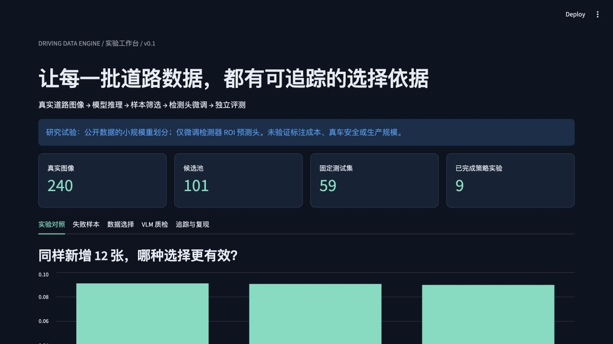
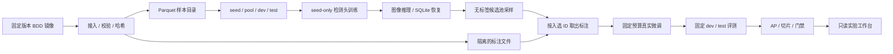

# Driving Data Engine · 道路长尾数据闭环

**在固定标注预算下，哪些道路图像值得加入训练？用真实模型和随机对照回答。**

真实道路图像 → 数据契约与去重 → 检测器推理 → 无标签采样 → 检测头微调 → 固定集回归。

本项目聚焦数据闭环研发：可追踪的数据决策、可恢复的处理流程与可复核的实验。代码由 AI 辅助开发；面试时应能独立解释和修改核心实现。

**已运行：240 张 BDD100K 图像、9 组真实训练对照、3 组匹配步数消融、真实 SmolVLM 场景标签实验、单机 Ray Data 处理与故障恢复。未验证人工标注成本或多机/PB 级部署。**

[](https://github.com/kimzclandi/driving-data-engine/actions/workflows/ci.yml)

[实验报告](docs/EXPERIMENT_REPORT.md) · [VLM 质检](docs/VLM_QUALITY.md) · [数据卡](docs/DATA_CARD.md) · [架构与权衡](docs/ARCHITECTURE.md) · [面试手册](docs/INTERVIEW_GUIDE.md) · [JD 证据地图](docs/JD_EVIDENCE.md)



## 为什么这个实验值得讨论

三种策略都新增 12 张图像，共用同一个种子模型，分别运行 17、29、43 三个随机种子：

| 采样策略 | 测试 AP × 100，均值 ± 种子标准差 | 相对随机抽样，AP 百分点 |
|---|---:|---:|
| Random | 9.043 ± 0.237 | 0 |
| Uncertainty | 8.963 ± 0.097 | −0.080 |
| Uncertainty + diversity | 9.089 ± 0.212 | +0.045 |

**多样性策略的微小优势不能视为显著收益。** 单纯挑高不确定样本没有稳定优于随机抽样。所有候选在夜间召回上均有下降，下降幅度约 0.90–2.40 个百分点；当前演示门槛容忍 5 个百分点，所以九组均 PASS。PASS 仅表示满足预设离线条件，不能解释为真车安全或生产可发布。

这些是 59 张测试图像上的局部结果。模型是低分辨率 MobileNetV3 Faster R-CNN，仅训练 466,375 个 ROI 预测头参数，其他参数和骨干统计量冻结；不是全量检测器训练，更不是 VLM 训练。

## 快速开始

已验证本地环境：macOS arm64、Python 3.12.13、PyTorch 2.14.0、Torchvision 0.29.0，**全部模型实验实际使用 CPU**。本机有 MPS，但未用于这组实验。依赖由 `uv.lock` 固定；远端检查状态以对应提交的 GitHub Actions 为准。

```bash
uv sync --locked --python 3.12 --extra dashboard --extra dev --extra distributed

# 下载固定版本的数据索引及 240 张图片；重复执行复用本地文件
uv run driving-data prepare
uv run driving-data verify

# 真实 warmup + 9 组采样/训练/评测；重复运行复用完整训练结果与推理缓存
uv run driving-data experiment

# 补充消融：相同优化步骤，但不新增图像
uv run driving-data controls

# 可选：真实本地 VLM，分别验证自由输出和有限标签输出
uv sync --locked --extra dashboard --extra dev --extra distributed --extra vlm
uv run driving-data vlm-quality
uv run driving-data vlm-quality --constrained

# 单机串行 / Ray 1、2、4 worker 正确性与计时
uv run driving-data benchmark

uv run pytest -q
uv run python scripts/check_reproducibility.py
uv run streamlit run dashboard.py --server.address 127.0.0.1
```

默认 Streamlit 地址为 `http://127.0.0.1:8501`。本次交付演示使用 **8512**，避免干扰已有项目。

联网仅用于依赖、数据和官方权重下载；准备完成后，CPU 实验无需 API key。下载索引约 71 MB，预训练权重约 78 MB，图像及训练检查点另占本地空间。原始图像、标注文件和权重不进入 Git。

如果只看结果，不训练：

```bash
uv run python scripts/verify_artifacts.py
uv run streamlit run dashboard.py --server.address 127.0.0.1
```

没有图像时，仪表盘仍能展示已保存的实验、采样与来源记录，并提示运行 `prepare`。

## 系统与职责



| 文件 | 可检查的工程决策 |
|---|---|
| `src/driving_data/data.py` | 来源锁定、并发下载、框校验、图像去重、组隔离、标签哈希 |
| `src/driving_data/store.py` | 单运行器锁、SQLite 原子提交、中断恢复、幂等结果 |
| `src/driving_data/model.py` | 真实像素输入、骨干特征、内容寻址缓存、失败不丢样本 |
| `src/driving_data/selection.py` | 严格无标签契约、三种采样、同组配额 |
| `src/driving_data/training.py` | 共同初始权重、等样本预算、随机种子、实际优化步骤 |
| `src/driving_data/evaluation.py` | pycocotools AP、一对一匹配、夜间/小目标/遮挡切片 |
| `src/driving_data/benchmark.py` | Ray Data 单机实测、输出一致性、调度开销 |

## 实验与工程证据

- [数据来源和划分](reports/pilot/data_receipt.json)：seed 44 / pool 101 / dev 36 / test 59。
- [预先固定的协议](reports/pilot/protocol.json)：预算、训练参数、随机种子与回归门槛。
- [完整采样决策](reports/pilot/selections.json)：入选 ID、排序、不确定性代理与零检测标记。
- [共同基线](reports/pilot/baseline/evaluation.json)：测试 AP 8.476；全量逐样本预测随报告保存。
- [实际微调记录示例](reports/pilot/diverse-s17/training.json)：输入 ID、标签哈希、优化步数、权重哈希。
- [对照汇总](reports/pilot/experiment.json)：均值、种子波动、配对差值与每次门禁。
- [匹配步数消融](reports/pilot/controls.json)：seed-only 8.896 AP，随机新增数据组 9.043 AP；补充对照为后验设计，不能当作独立确认性试验。
- [真实 VLM 原始输出](reports/pilot/vlm_quality/results.json)：自由输出下 22/36 格式不合规；没有用清洗后的数字掩盖失败。
- [真实中断恢复](reports/pilot/pretrained/run_receipt.json)：5 缓存命中、1 中断任务恢复、240 个最终结果。
- [Ray 实测](reports/pilot/benchmark.json)：本次小工作负载的串行处理快于 Ray；不隐藏负收益。
- [重复训练与推理核验](reports/pilot/reproducibility.json)：见实际检查范围，不能扩大成全平台保证。

## 真实性与局限

1. 数据来自 BDD100K **验证集的第三方固定版本镜像**，重新划分用于教学研究；不是官方 train/test benchmark。
2. 文件名前缀作为保守分组键，另阻断完全相同图像。未证明路线/驾驶员隔离，也未实现近重复聚类。
3. 模型只读取 RGB 图像。候选池采样不读取真实框、天气、时段标签；公开标注在选择之后才提供给训练过程，模拟标注获取。
4. 等预算指同样新增 12 张图像，不等于同样人工时间或标注框数量；未验证省钱。
5. 仅映射七个 COCO 类别，`rider` 并入 `person`，忽略 `traffic sign`、`train` 等不在当前范围的类。不是完整驾驶感知模型。
6. AP 使用保留分数 ≥ 0.05 的预测；运行点召回使用 score ≥ 0.5、IoU ≥ 0.5。小目标以原图面积 < 32² 像素定义。
7. 与 warmup 比较时还有额外训练步骤的影响；已补充三组匹配步数的 seed-only 对照，但它是后验设计、复用了公开测试集。不能把相对 warmup 的全部增益归因于新增数据。
8. 分布式部分仅运行了单机 Ray Data 图像质检。神经推理为单进程，SQLite 不是多机任务调度器。
9. SmolVLM 仅做 36 张 dev 图像的昼夜标签实验，参考标签未独立人工裁决；不等于全自动标注，也没有 VLM 训练或降本收益。

代码采用 MIT；数据遵循 [BDD100K 原始条款](docs/BDD100K_LICENSE.rst)，不可用代码许可证覆盖数据许可。数据来源与模型链接见 [数据卡](docs/DATA_CARD.md)。
