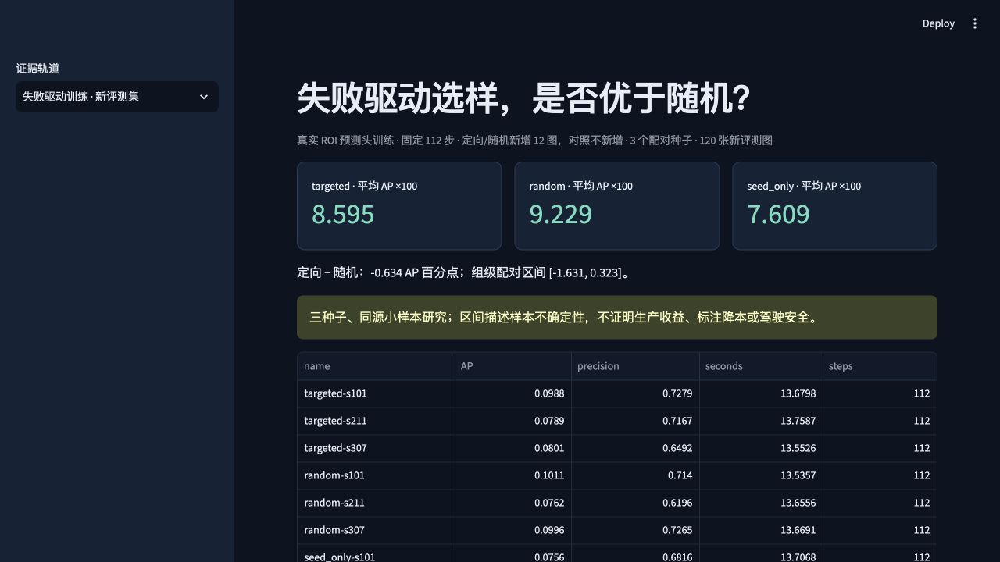

# 小样本目标检测数据选择实验

[](https://github.com/kimzclandi/driving-data-engine/actions/workflows/ci.yml)

在 BDD100K 子集上研究：固定新增图像预算时，哪些图像值得加入检测器训练？仓库实现了随机、不确定性、多样性选样，以及从开发集漏检构造原型的定向选样。各组共用预训练 Faster R-CNN MobileNetV3，**仅微调 ROI 预测头**；当前实验没有证明定向选样稳定优于随机。

`driving-data-engine` 是本机资源下的个人研究项目。输入为道路图像及已有标注，产物包括选样名单、训练记录、逐图预测和分组评测；标注在选样后提供给训练流程，用于模拟新增标注。

## 项目沿革（2026-09-20 补记）

根据维护者对本地开发过程的说明，相关早期工作约于 2026 年 7—8 月开始在本地开展，之后集中整理并上传 GitHub。该月份是早期工作的近似起点，不表示当前全部功能和实验在当时已完成。后续实现、实验与维护保留各自的实际版本及运行日期。

## 当前结果

最新训练对照使用新的 120 张评测图、三个随机种子；各组均训练 112 步，定向与随机各新增 12 图。与早期 240 图 pilot 的结果分开报告。

| 方法 | 测试 AP × 100，三种子均值 |
|---|---:|
| 定向选样 | 8.595 |
| 随机选样 | 9.229 |
| seed-only（重复旧图，匹配步数） | 7.609 |

定向−随机为 **−0.634 AP 点**，前缀组配对 bootstrap 区间为 **[−1.631, +0.323]**。区间跨零，不能声称选样收益。后续开发集诊断中，完整分数与低分质量项的秩相关为 0.988，留组原型 AUC 为 0.395；这些是关联诊断，不是 AP 差异的因果解释，也没有据此追加训练。

[训练对照报告](docs/FAILURE_V2_REPORT.md) · [开发集诊断](docs/DIAGNOSIS_V3_REPORT.md) · [原始训练结果](reports/failure_v2/summary.json) · [诊断记录](reports/diagnosis_v3/result.json)

## 查看与运行

从仓库根目录安装锁定依赖，先查看已保存结果；此路径不下载图像或运行训练。

```bash
uv sync --locked --python 3.12 --extra dashboard --extra dev
uv run python scripts/verify_artifacts.py
uv run streamlit run dashboard.py --server.address 127.0.0.1
```

默认打开 **「失败驱动训练 · 新评测集」**查看上表；「历史训练 / VLM 推理」展示早期实验。默认端口为 8501，可用 `--server.port 8512` 自行指定。开发集诊断界面：`uv run streamlit run diagnosis_dashboard.py`。



截图来自该训练实验的本地运行，不代表后续诊断或新的训练。无原图时可查看指标与记录；查看图像及重跑模型需要另行准备数据和固定权重。

[运行说明：结果回放、数据准备与训练](docs/RUNNING.md) · [训练协议与恢复](docs/FAILURE_V2_PROTOCOL.md) · [数据卡及许可](docs/DATA_CARD.md)

## 实现与贡献范围

本仓库实现数据划分与校验、候选池评分、固定预算对照、预测头训练、切片评测和结果浏览。检测器结构、预训练权重及 COCO AP 计算分别来自 Torchvision 和 pycocotools；没有从零实现或训练完整检测器。代码、测试与文档使用 AI 辅助开发。

- [选样实现](src/driving_data/selection.py)、[训练实现](src/driving_data/training.py)、[后续实验实现](src/driving_data/failure_loop.py)。
- [架构说明](docs/ARCHITECTURE.md)：Parquet/DuckDB 查询、SQLite 恢复与单机 Ray 实验的职责。
- [历史与扩展实验](docs/RESEARCH_INDEX.md)：pilot、SmolVLM 昼夜质检、Ray 计时及方法文档。

## 主要限制

- 使用 BDD100K 验证集的固定第三方镜像重新划分，小样本、本机 CPU；不是官方 benchmark。前缀分组不保证路线或驾驶员隔离。
- 只更新 466,375 个 ROI 预测头参数，骨干和统计量冻结；没有全量检测器训练或 VLM 训练。
- 等图数不等于等框数、人工时间或标注费用。未验证人工降本、真实驾驶或部署效果。
- Ray 仅做单机数据处理实验，这一小工作负载中慢于串行；不能代表多机生产能力。
- 三个训练种子和小评测集限制统计结论；旧 pilot 的后验等步数消融、失败记录及负结果均保留。

代码 [MIT](LICENSE)；数据遵循 [BDD100K 条款](docs/BDD100K_LICENSE.rst)。

[2026-09-19 工程维护与验证边界](docs/maintenance/2026-09-19/README.md)
