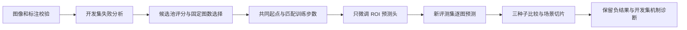

# 数据选择实验阅读与复核指南

## 输入输出与研究问题

输入为 BDD100K 道路图像及已有检测标注。仓库输出数据校验记录、选样名单、训练日志、逐图预测和切片统计。选样后再给训练流程提供标注，用于模拟新增标注；未测量真实标注时间或费用。

## 不要混合三个实验阶段

| 阶段 | 研究内容 | 入口 |
|---|---|---|
| 历史 pilot | 240 图数据流程、随机/不确定性/多样性选择 | [历史索引](RESEARCH_INDEX.md) |
| failure v2 | 新 120 图评测集，定向/随机/seed-only 匹配步数训练 | [训练协议](FAILURE_V2_PROTOCOL.md)与[报告](FAILURE_V2_REPORT.md) |
| diagnosis v3 | 在开发集分析分数构成、排序与留组原型 | [诊断报告](DIAGNOSIS_V3_REPORT.md) |

v3 没有追加模型训练，不能把其关联统计写成对 v2 AP 差异的因果证明。历史 pilot 与新评测集分母不同，分数不能直接串成进步曲线。

## 对照设计与结果解释

当前训练对照采用三个种子，每组 112 步；定向和随机各新增 12 图，seed-only 通过重复旧图匹配步数。骨干和统计量冻结，只更新 ROI 预测头。等步数控制计算量的一部分，但等图数不等于等框数或人工费用。

AP 表使用 AP × 100 的单位。定向 8.595、随机 9.229，差为 −0.634 AP 点；前缀组配对 bootstrap 区间跨零。现有实验未证明稳定选样收益，也不证明所有定向选样方法无效。前缀分组不是已验证的路线或驾驶员隔离。

## 代码与证据路径

- [selection.py](../src/driving_data/selection.py)：历史选样策略。
- [training.py](../src/driving_data/training.py)：预测头训练。
- [failure_loop.py](../src/driving_data/failure_loop.py)：后续训练对照。
- [训练汇总](../reports/failure_v2/summary.json)与[诊断结果](../reports/diagnosis_v3/result.json)：当前结论的保存证据。
- [架构说明](ARCHITECTURE.md)：图像数据契约、Parquet/DuckDB 查询和 SQLite 恢复语义。

## 运行与故障处理

先按[运行说明](RUNNING.md)安装，再执行 `uv run python scripts/verify_artifacts.py`。它验证发布记录完整性，不重算 AP、不训练模型。Dashboard 读取保存结果；无原始图片时仍可查看指标，不能因此声称已重新运行图像处理。

完整重跑需要原始数据、固定权重与独立 checkout。历史 CLI 会写数据和报告目录；不要直接在存放参考证据的 checkout 运行。失败时检查数据、权重和协议摘要，不修改冻结摘要来掩盖差异。

SQLite 恢复保证同一内容 key 最多一条已提交结果，允许提交前的重复计算；不是任务只执行一次。缓存 key 包括图像、模型和推理配置，设备或依赖变化也可能使缓存失效。永久错误应终止整轮，不能删除失败样本缩小评测分母。

新增数据、全检测器训练、多轮主动学习和真实费用比较都是后续实验，不属于当前结果。新的选择策略应在开发数据上设计，并配套独立评估。
