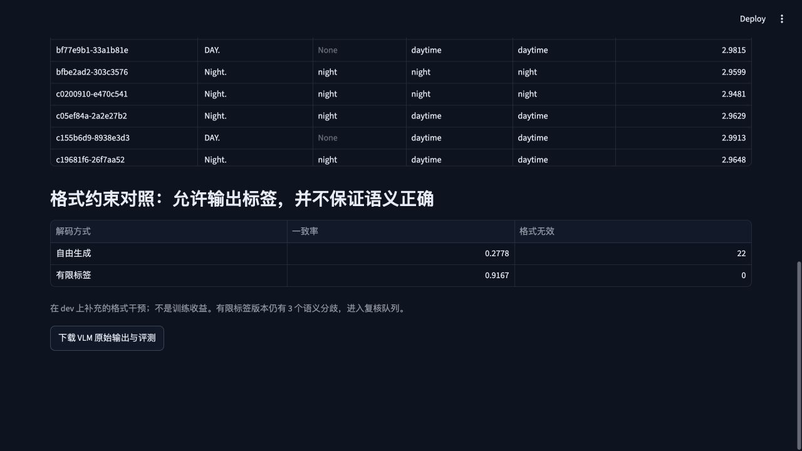

# 真实 VLM 场景标签实验

**有限标签解码解决了输出格式问题，但没有解决全部语义错误。** 在同一批 36 张 dev 图像上，自由输出的严格标签一致率为 27.78%，有限标签版本为 91.67%；后者仍有 3 张夜间图像被判断为白天。这不是模型训练收益。



## 输入、输出与来源

- 模型：[HuggingFaceTB/SmolVLM-256M-Instruct](https://huggingface.co/HuggingFaceTB/SmolVLM-256M-Instruct)。
- 官方用法：[SmolVLM Transformers 文档](https://huggingface.co/docs/transformers/model_doc/smolvlm)。
- 固定 revision：`7e3e67edbbed1bf9888184d9df282b700a323964`，模型卡标示 Apache-2.0。
- 推理在本机 CPU float32 执行；不向外部 API 上传图片，不训练 VLM。
- 输入仅 RGB 图像与固定英文提示，要求输出 `daytime` 或 `night`。没有把天气、时段、真实框或标签放入提示。
- 图片先保比例缩到最大边 512，再交给模型自带 processor；processor 默认产生多个视觉 crop，所以不应把“512 输入”误解为只有单个视觉 patch。实际输入张量形状逐样本保存。
- 官方来源时段标签只在推理后 join，用于一致性评价；未经过本项目独立人工裁决。

## 同一任务的基线

| 方法 | 参考标签一致率 | 平衡准确率 | 格式无效 | 夜间召回 |
|---|---:|---:|---:|---:|
| 永远回答 daytime | 75.00% | 50.00% | 0/36 | 0/9 |
| 灰度平均值 < 70 为 night | 100.00% | 100.00% | 0/36 | 9/9 |
| VLM 自由生成 + 严格解析 | 27.78% | 44.44% | 22/36 | 7/9 |
| VLM 有限标签解码 | 91.67% | 83.33% | 0/36 | 6/9 |

数据只有 daytime 27 张、night 9 张。准确率会被多数类影响，所以同时报告逐类召回和平衡准确率。亮度规则在这个小集合完全一致，不代表跨地区、隧道、黄昏或摄像头曝光条件下也可靠，也不说明 VLM 永远无用。

## 格式干预是什么

自由生成产生了 `DAY.`、`LIGHT.`、`Rainy.` 等非规范标签。解析器只接受去掉大小写和外层标点后的 `daytime`、`night`，没有用事后语义猜测悄悄修改原始输出。

补充版本使用 tokenizer 的有限标签前缀树，在生成每一步只允许走向两个规范标签的 token，完成标签后只允许 EOS。这样能消除格式无效，但类别仍由模型在允许路径中的分数决定，不读取真实标签。

这个补充是在观察自由输出错误后设计的 dev 集改进，不是预注册独立测试。两份协议、原始文本、指标与检查点哈希分别保存，原始结果未覆盖。

注意：有限标签版本夜间召回低于自由生成中恰好输出合法夜间标签的表现。不能只看总体一致率，从 27.78% 到 91.67% 就声称夜间识别增强。

## 怎样形成工程闭环

原始输出 → 严格解析 → 输出合法性检查 → 与规则/来源标签比对 → 无效或分歧进入 `unreviewed` 队列。当前自由版本 26 个待复核样本，有限标签版本 3 个。队列状态没有被自动改成“已人工审核”。

36 张两种解码共 72 次真实模型推理，系统异常为 0；模型失误与格式失误仍保留在分母。每条记录保留 raw output、模型和提示版本、图像哈希、输入形状、耗时和参考标签。

当前任务的实际选择：保留便宜的规则基线，将 VLM 作为受控实验组件。若扩展到遮挡描述、场景语义或标注一致性，必须另建任务定义与人工审核集，不能套用当前昼夜一致率。

## 复现与证据

```bash
uv sync --locked --extra dashboard --extra dev --extra distributed --extra vlm
uv run driving-data prepare
uv run driving-data vlm-quality
uv run driving-data vlm-quality --constrained
```

首次执行下载官方模型，后续复用本地权重。图像结果缓存在 `work/vlm_cache/`，内容 key 包括数据/提示协议、图像哈希、模型权重哈希。要独立全量重跑，应把该缓存目录移动到备份位置再执行；默认重跑会复用成功结果。

- [自由输出协议](../reports/pilot/vlm_quality/protocol.json)
- [自由输出原始结果](../reports/pilot/vlm_quality/results.json)
- [有限标签协议](../reports/pilot/vlm_quality_constrained/protocol.json)
- [有限标签原始结果](../reports/pilot/vlm_quality_constrained/results.json)
